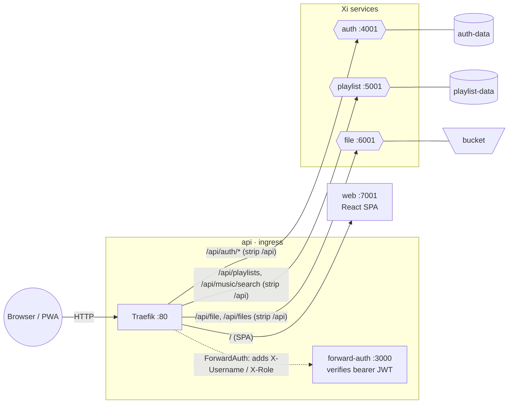

# eXstream

eXstream is a streaming web app with separate services for ingress, auth, file storage, playlists, and the web player written in [Xi](https://code-by-sia.github.io/xi/) programming language.


## Architecture



All backend endpoints are published under the `/api` prefix; Traefik strips it (`StripPrefix`) before forwarding, so the services keep their unprefixed routes (`/auth`, `/playlists`, `/file`). Public routes (`/api/auth/register`, `/api/auth/login`, `/api/auth/verify`, and the SPA) skip the auth middleware; every other API route passes through `forward-auth`, which validates the bearer JWT and forwards the caller identity to the services as `X-Username` and `X-Role` headers. The `auth` and `forward-auth` services share the same `JWT_SECRET`.

## Modules

- `api`: Traefik ingress and reverse proxy. Protected routes use a ForwardAuth helper that verifies the bearer JWT and forwards `X-Username` and `X-Role`.
- `auth`: Xi service for registration, login, reset password, token verification, and user profile. Default port: `4001`.
- `playlist`: Xi service for playlist CRUD and music search. Default port: `5001`.
- `file`: Xi file service for create, read, update, delete, and list. Default port: `6001`.
- `web`: React JavaScript music player UI with Tailwind, shadcn-style UI primitives, and Zustand. Default port: `7001`.
- `common`: shared Xi interfaces (config, security, util) and `config.yaml`, gathered into every service.

Each backend service is a **root-level Xi module** (`auth-service.xi`, `playlist-service.xi`, `file-service.xi`) that gathers its own folder plus `common/` by glob — no per-service import barrel. The `auth` and `playlist` services persist through `common/data/sqlite-query-provider.xi`, a `std/data`/`std/query` `QueryProvider` over a small vendored sqlite binding (`common/sqlite/`) — no external dependency.

### Configuration

All services share [`common/config.yaml`](common/config.yaml) — ports and storage paths — read at runtime through the typed `AppConfig` interface (`std/config`). Each service binds it with `bind AppConfig -> readConfig("common/config.yaml")` in its `module App`; a port can still be overridden by a command-line argument.

### Storage & layering

The `auth` and `playlist` services persist to SQLite (`auth.db`, `playlists.db` under the configured `dataDir`) via `std/data`'s repository/`QueryProvider` model: reads use typed `query.from<Row>().filter{}.collect(provider)` chains and writes use the provider's generic `insert`/`remove`, so there is no hand-built SQL and no per-entity write glue. The `file` service stores uploads as real files under `fileStorageDir`. Every service follows the same layered, dependency-injected design: behaviour lives in classes behind small interfaces, with the **interfaces in `business/`** and their **implementations in `business/impl/`**. HTTP handlers, repositories, JWT handling, path parsing, and access checks are all injected implementations — there are no loose top-level functions (only `entry main` and plain `type` declarations sit outside a class). Responses are serialized directly with `res.send(...)`. Swap any piece by binding a different implementor in `module App`.

## API Specs

- Auth: [`auth/api-spec.yaml`](auth/api-spec.yaml)
- Playlist: [`playlist/api-spec.yaml`](playlist/api-spec.yaml)
- File: [`file/api-spec.yaml`](file/api-spec.yaml)

## Run Locally With Docker

```sh
docker compose up --build
```

The Xi service images install the Xi toolchain with `brew install
code-by-sia/xi/xi` (the tap tracks the latest release).

- Web UI: http://localhost:7001
- API gateway: http://localhost:8080
- Traefik dashboard: http://localhost:8081
- Auth service: http://localhost:4001
- Playlist service: http://localhost:5001
- File service: http://localhost:6001

Set a shared JWT secret when needed:

```sh
JWT_SECRET="change-me" docker compose up --build
```

The auth service seeds two development users on startup:

| Username | Password | Role | Profile |
| --- | --- | --- | --- |
| `admin` | `admin123` | `ADMIN` | Admin |
| `test` | `test123` | `USER` | Test Listener |

The playlist service seeds initial royalty-free generated music for the `test` user:

| Playlist | Tracks |
| --- | --- |
| Starter Favorites | Midnight Pulse, Glass Harbor, Solar Steps |
| Ambient Loops | Slow Orbit, Clean Room, Open Sky |

Seeded tracks use compact `tone:` URLs that the web player turns into generated WAV audio at playback time.

## Deploy on Kubernetes

The [`deploy/`](deploy) folder ships the full stack as Kubernetes objects — Deployments, Services, HPAs, PersistentVolumeClaims, a Traefik `IngressRoute` with the ForwardAuth `Middleware`, plus the Secret and ConfigMap they rely on. See [`deploy/README.md`](deploy/README.md) for the step-by-step guide.

## Build Xi Services Locally

```sh
xc auth-service.xi
xc playlist-service.xi
xc file-service.xi
```

Requires Xi ≥ 0.1.0 "Berlin" (ships `std/data`/`std/query`/`std/sql`) and the
SQLite library on the host (preinstalled on macOS; `libsqlite3-dev` on
Debian/Ubuntu). Run them directly:

```sh
./build/auth-service
./build/playlist-service
./build/file-service
```

Each service accepts an optional port argument.

## Run Web Locally

```sh
cd web
npm install
npm run dev
```

The Vite dev server runs on http://localhost:7001.
When running the web app outside Docker, point the dev proxy at the gateway if needed:

```sh
VITE_API_TARGET=http://localhost:8080 npm run dev
```

In Docker Compose, the web service runs the Vite dev server with `./web` bind-mounted into the container, so React changes hot reload without rebuilding the image.

Useful web routes:

- `/login`: Login and registration.
- `/`: Music library home.
- `/playlists/:id`: Deep link to a playlist.
- `/search?q=term`: Deep link to music search results.

Admins manage music inline: an "Add music" button in the page hero batch-uploads MP3s (reading title, artist, and embedded album art from each file), and track rows show edit/delete actions. Any user can add a song to multiple playlists or move it between them from a track row's "Add to playlist" action. Album art is extracted on upload and cached in the file service; tracks without embedded art fall back to a deterministic generated cover.

The web app supports dark mode, mobile-friendly layouts, and PWA installation via its web manifest and service worker.
Admin music management uploads audio through the file service, then stores the uploaded file path on playlist tracks.

## Tests

Run Xi unit tests via each service's root test module (it globs the service and
its `test/` folder and runs every gathered test block):

```sh
xi test auth-test.xi
xi test playlist-test.xi
xi test file-test.xi
```

Run JavaScript tests:

```sh
node --test api/test/*.test.js
cd web && npm test
```

Run service smoke tests:

```sh
./scripts/test-services.sh
```

## API Examples

Register:

```sh
curl -X POST http://localhost:8080/api/auth/register \
  -H 'Content-Type: application/json' \
  -d '{"username":"sia","password":"secret","profileName":"Sia","email":"sia@example.com","avatar":"🎧"}'
```

Create a playlist through the gateway:

```sh
curl -X POST http://localhost:8080/api/playlists \
  -H 'Content-Type: application/json' \
  -H "Authorization: Bearer $TOKEN" \
  -d '{"name":"Favorites","description":"Daily rotation"}'
```

Direct service calls to protected endpoints must include:

```text
X-Username: sia
X-Role: USER
```
